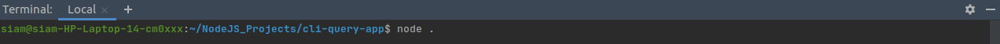
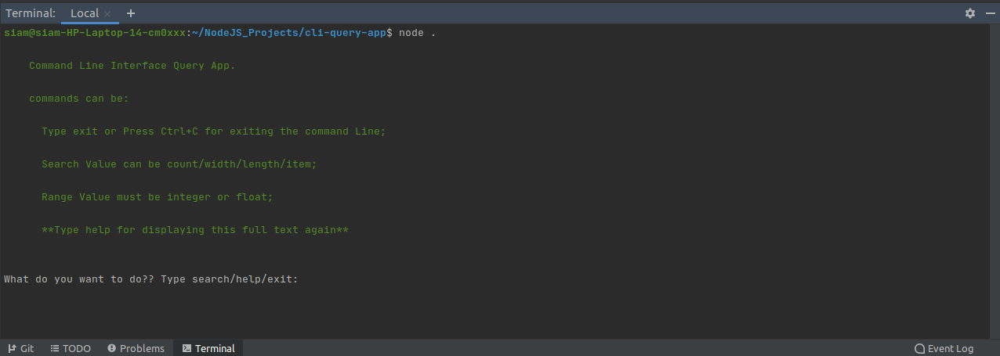
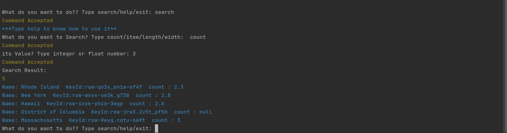
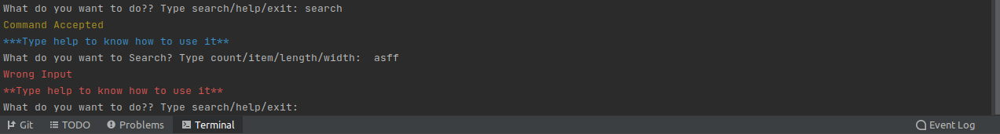
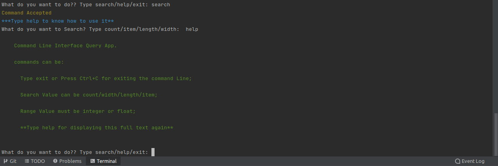
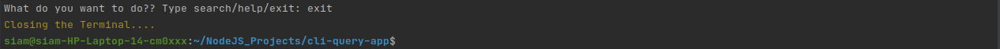

#Command Line Interface (CLI) Query App

* [Description](#Description:)
* [Main Packages & Require Modules](#main-packages--require-modules)
* [Installation](#Installation:)
* [Usage](#Usage:)
* [Contributing](#Contributing:)
* [Credits](#Credits:)
* [License](#License:)

##Description: 

This is a Command Line Interface (CLI) Query App which was created by Using **Node JS**. CLI is a command line program that accepts text input to execute operating system functions. Command line applications (CLI) are often the main tools for automating tasks, like deploying production applications, running tests, building reports, migrating data, DevOps, and the so many.

**Node.js** is a great solution for writing CLI apps. Node.js itself has built-in libraries for reading and writing files, launching other applications, and basic network communication. Beside that, there are lots of packages available on **npm** for just about any kind of task thinkable.

In this project any one can do query from the database (**data.json**) file by using **Terminal**. **data.json** file was created by using **rows.json** which was downloaded from [here](https://data.cdc.gov/api/views/rqg5-mkef/rows.json?accessType=DOWNLOAD&fbclid=IwAR36AQjQ1GjOYtqvFAQBuuedL27Sd4-5IalLg7aeEI9WIV1xoagT8IbXurE) .

##Main Packages & Require Modules:

* chalk
* readline module
* fs module
* path module

##Installation: 

To download from GitHub, you should navigate to the top level of the project (SDN in this case) and then a green **"Code"** download button will be visible on the right. Choose the Download ZIP option from the Code pull-down menu. That ZIP file will contain the entire repository content, including the area you wanted. That's the best way to download from GitHub.
After unzipping the project , you have to open it in your Text Editor (Sublime Text or VS Code or webstorm or so on)  . And From that time you have the full access in CLI Query Project,do query as much as you can. 

##Usage:

Now for using this query app , you have to open the terminal in your text editor and write down the command line,

And You will get following result: 

Now You can do query as much as you can through terminal:

if you give any wrong input, it will throw a **error** and its operation will start again:

Moreover, if you got stuck with something, don't panic. **help** command is always there for you.

And Finally you can just close the operation anytime by writing **exit** command.

##Contributing: 

Contributions are always welcome! Please read the following instructions first.  

* Clone the project to your own machine.
* Commit changes to your own branch.
* Suggested README file should be beautiful or stand out in some way.
* Keep descriptions short and simple, but descriptive.
* Start the description with a capital and end with a full stop/period.
* Check your spelling and grammar.
* Make sure your text editor is set to remove trailing whitespace.
* Push your work.
* Submit a Pull request so that I can review your changes. 
* If possible Make an individual pull request for each suggestion.

## Credits:

*  Mohammed Siam Anzir [Github](https://github.com/SiamAnzir)

## License:

**(ISC License)**

Copyright (c) 2021, Mohammed Siam Anzir (siamanzir18@gmail.com)

Permission to use, copy, modify, and/or distribute this software for any purpose with or without fee is hereby granted, provided that the above copyright notice and this permission notice appear in all copies.

THE SOFTWARE IS PROVIDED "AS IS" AND THE AUTHOR DISCLAIMS ALL WARRANTIES WITH REGARD TO THIS SOFTWARE INCLUDING ALL IMPLIED WARRANTIES OF MERCHANTABILITY AND FITNESS. IN NO EVENT SHALL THE AUTHOR BE LIABLE FOR ANY SPECIAL, DIRECT, INDIRECT, OR CONSEQUENTIAL DAMAGES OR ANY DAMAGES WHATSOEVER RESULTING FROM LOSS OF USE, DATA OR PROFITS, WHETHER IN AN ACTION OF CONTRACT, NEGLIGENCE OR OTHER TORTIOUS ACTION, ARISING OUT OF OR IN CONNECTION WITH THE USE OR PERFORMANCE OF THIS SOFTWARE.

Source: http://opensource.org/licenses/ISC

